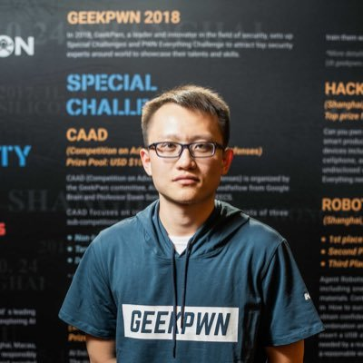
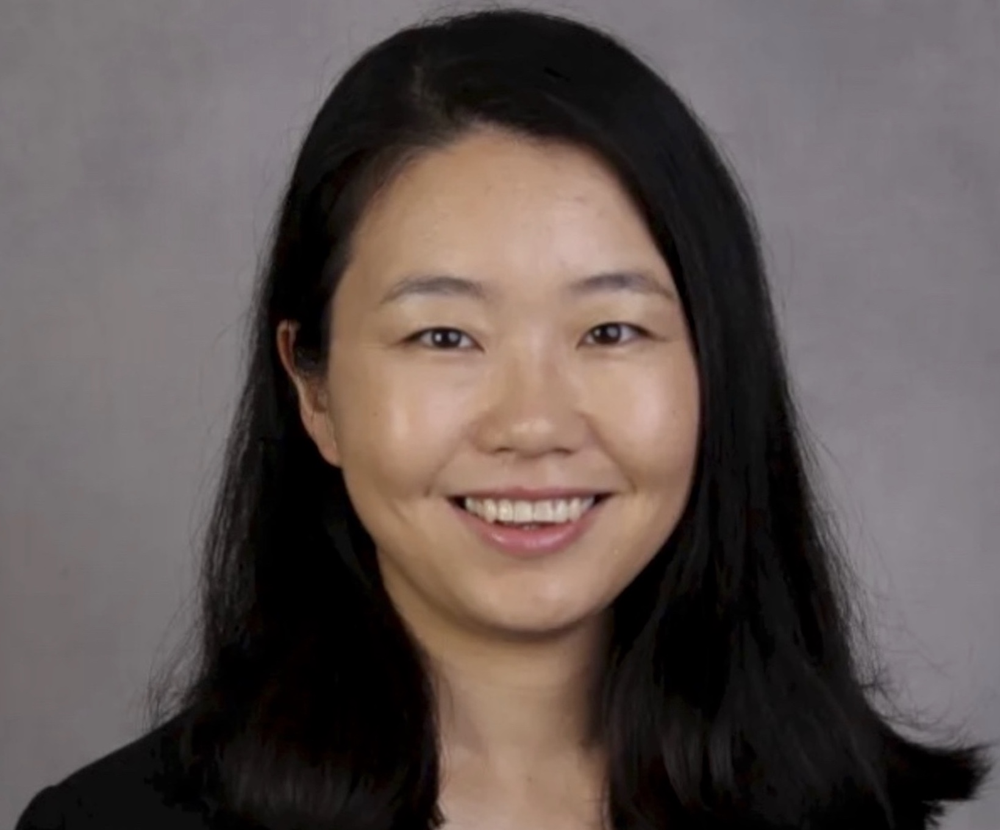
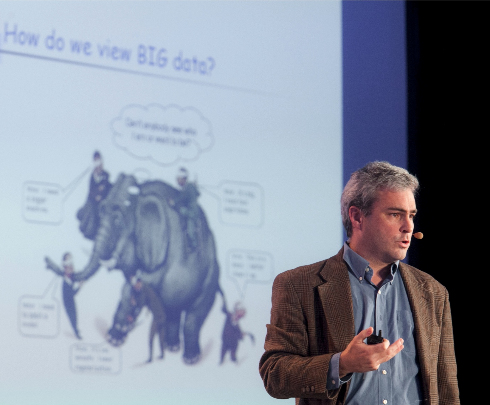
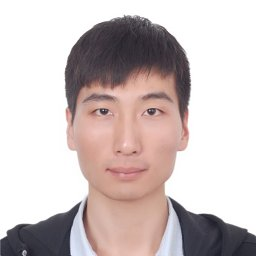

# Overview

| **Date** | May 5, 2023 (9 am - 18:00 pm US Eastern Daylight Time) |
| **Link** | [https://iclr.cc/virtual/2023/workshop/12825](https://iclr.cc/virtual/2023/workshop/12825) (ICLR registration required)
| **Location** | *Virtually*
| **Schedule** | [Click here](./schedule)

Backdoor attacks aim to cause consistent misclassification of any input by adding a specific pattern called a trigger. Unlike adversarial attacks requiring generating perturbations on the fly to induce misclassification for one single input, backdoor attacks have prompt effects by simply applying a pre-chosen trigger. Recent studies have shown the feasibility of launching backdoor attacks in various domains, such as computer vision (CV), natural language processing (NLP), federated learning (FL), etc. As backdoor attacks are mostly carried out through data poisoning (i.e., adding malicious inputs to training data), it raises major concerns for many publicly available pre-trained models. Companies relying on user data to construct their machine learning models are also susceptible to backdoor attacks.

<!-- Defending against backdoor attacks has sparked multiple lines of research, including detecting inputs with backdoor triggers, determining whether a model has hidden backdoors, eliminating potential backdoors inside a model, etc. Many defense techniques are effective against some particular types of backdoor attacks. However, with increasingly emerging diverse backdoors, the defense performance of existing work tends to be limited. Most defense techniques and attacks are developed for the computer vision domain. It is yet to explore the connection between attacks and defenses among different domains. -->

This workshop, **B**ackdoor **A**ttacks a**N**d **D**efen**S**es in Machine Learning (**BANDS**), aims to bring together researchers from government, academia, and industry that share a common interest in exploring and building more secure machine learning models against backdoor attacks. 

<!-- With the wide adoption of large pre-trained models in real-world applications, any injected malicious behaviors, such as backdoors in those models, are particularly concerning. It is, therefore, particularly important to gather researchers in the area and expand the community to improve the security of machine learning. -->

<!-- This workshop aims to answer the following questions:
- What other types of backdoor attacks can we find in CV/NLP/FL machine learning models?
- Can we launch backdoor attacks in other domains, such as binary analysis tools, network intrusion detection systems, reinforcement learning, etc.?
- What are the similarities and differences of backdoor attacks in various tasks?
- How can we measure the stealthiness of backdoor attacks in different domains? What are the costs and practicality of launching backdoor attacks in the real world?
- What is the performance of existing defense techniques in studied domains? Can they be adapted to other domains?
- How can we develop a general defense method against a variety of backdoor attacks and even unseen attacks?
- Are there other forms of defenses that are practical in the real world? -->

# Featured Speakers
Speakers are in alphabetical order by last name.

||||
|[Pin-Yu Chen](https://sites.google.com/site/pinyuchenpage/home) IBM Research AI|[Wenbo Guo](https://henrygwb.github.io/) UC Berkeley|[Amir Houmansadr](https://people.cs.umass.edu/~amir/) University of Massachusetts |
||||
[Ruoxi Jia](https://ruoxijia.info/) Virginia Tech |[Bo Li](https://aisecure.github.io/) UIUC|[Michael Mahoney](https://www.stat.berkeley.edu/~mmahoney/) UC Berkeley and ICSI|
||||
|[Vitaly Shmatikov](https://www.cs.cornell.edu/~shmat/) Cornell Tech |[Yang Zhang](https://yangzhangalmo.github.io/) CISPA|[Ben Y. Zhao](https://people.cs.uchicago.edu/~ravenben/) UChicago |

# Panelists
Panelists are in alphabetical order by last name.

||||
|[Pin-Yu Chen](https://sites.google.com/site/pinyuchenpage/home) IBM Research AI|[Ruoxi Jia](https://ruoxijia.info/) Virginia Tech |[Bo Li](https://aisecure.github.io/) UIUC|
|||
|[Vitaly Shmatikov](https://www.cs.cornell.edu/~shmat/) Cornell Tech |[Ben Y. Zhao](https://people.cs.uchicago.edu/~ravenben/) UChicago |

# Best Paper Award
- <b>[How to Backdoor Diffusion Models?](https://openreview.net/pdf?id=iIg0_loMVm)</b>   Sheng-Yen Chou (National Tsing Hua University & The Chinese University of Hong Kong), Pin-Yu Chen (IBM Research), Tsung-Yi Ho (The Chinese University of Hong Kong)

# Organizers

|||||
|[Guanhong Tao](https://www.cs.purdue.edu/homes/taog/) Purdue University|[Kaiyuan Zhang](https://kaiyuanzhang.com/) Purdue University|[Shawn Shan](https://www.shawnshan.com/) University of Chicago|[Emily Wenger](https://www.emilywenger.com/) University of Chicago|
|||||
|[Rui Zhu](https://nextjs-notion-starter-kit-sigma-three.vercel.app/) Indiana University|[Eugene Bagdasaryan](https://www.cs.cornell.edu/~eugene/) Cornell Tech|[Naren Sarayu Manoj](https://www.nsmanoj.com/) TTIC|[Taylor Kulp-McDowall](https://www.linkedin.com/in/taylorwk/) IARPA|
||||
|[Yousra Aafer](https://cs.uwaterloo.ca/~yaafer/) University of Waterloo|[Shiqing Ma](https://people.cs.rutgers.edu/~sm2283/) Rutgers University|[Xiangyu Zhang](https://www.cs.purdue.edu/homes/xyzhang/) Purdue University|