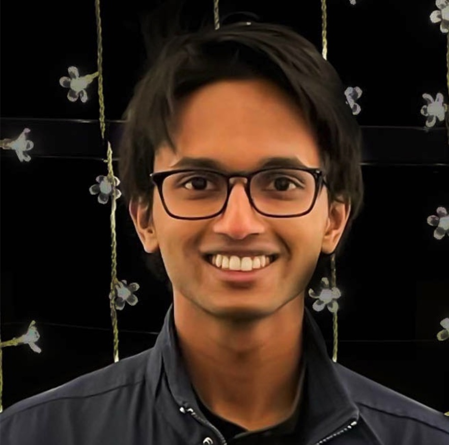
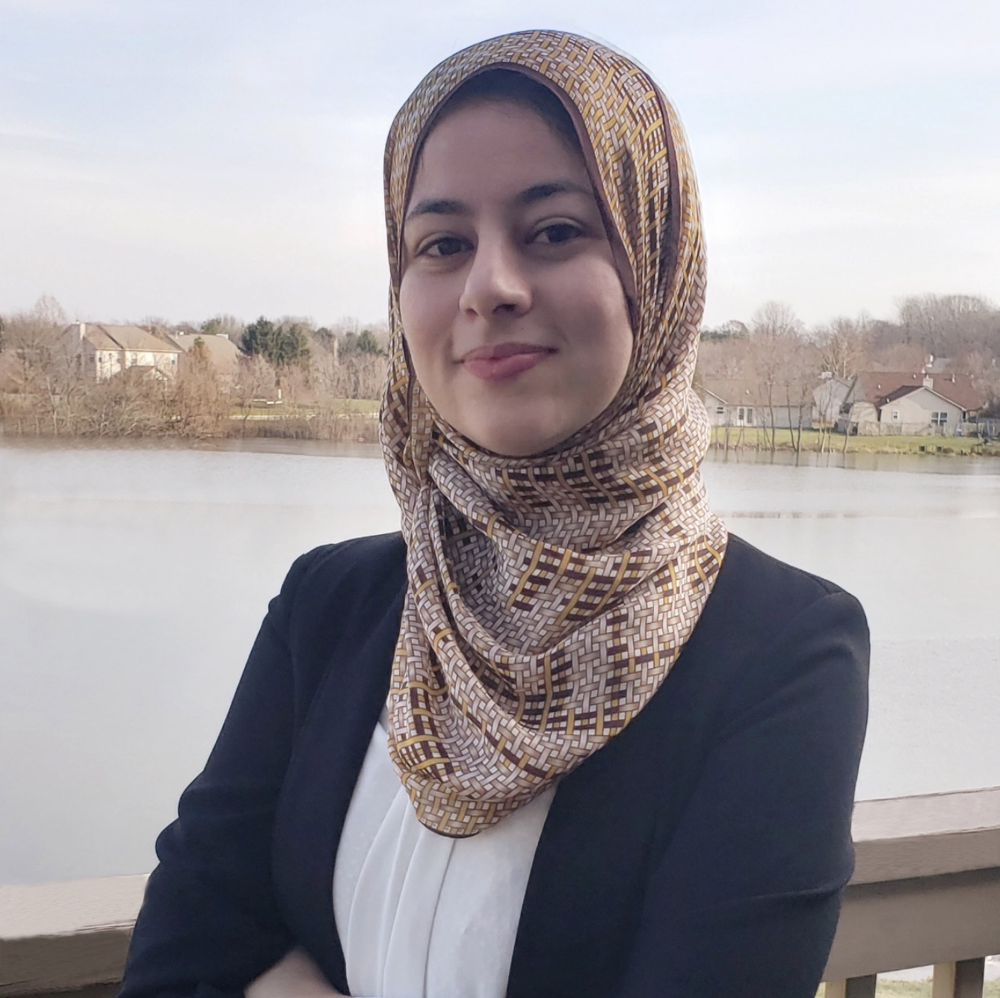
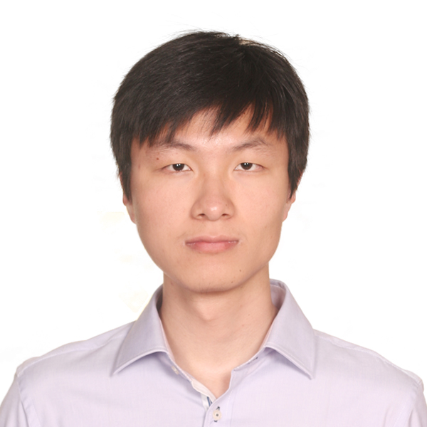

# Organizers

||||||
|[Guanhong Tao](https://www.cs.purdue.edu/homes/taog/) Purdue University|[Kaiyuan Zhang](https://kaiyuanzhang.com/) Purdue University|[Shawn Shan](https://www.shawnshan.com/) University of Chicago|[Emily Wenger](https://www.emilywenger.com/) University of Chicago|[Rui Zhu](https://nextjs-notion-starter-kit-sigma-three.vercel.app/) Indiana University|
||||||
|[Eugene Bagdasaryan](https://www.cs.cornell.edu/~eugene/) Cornell Tech|[Naren Sarayu Manoj](https://www.nsmanoj.com/) TTIC|[Yousra Aafer](https://cs.uwaterloo.ca/~yaafer/) University of Waterloo|[Shiqing Ma](https://people.cs.rutgers.edu/~sm2283/) Rutgers University|[Xiangyu Zhang](https://www.cs.purdue.edu/homes/xyzhang/) Purdue University|