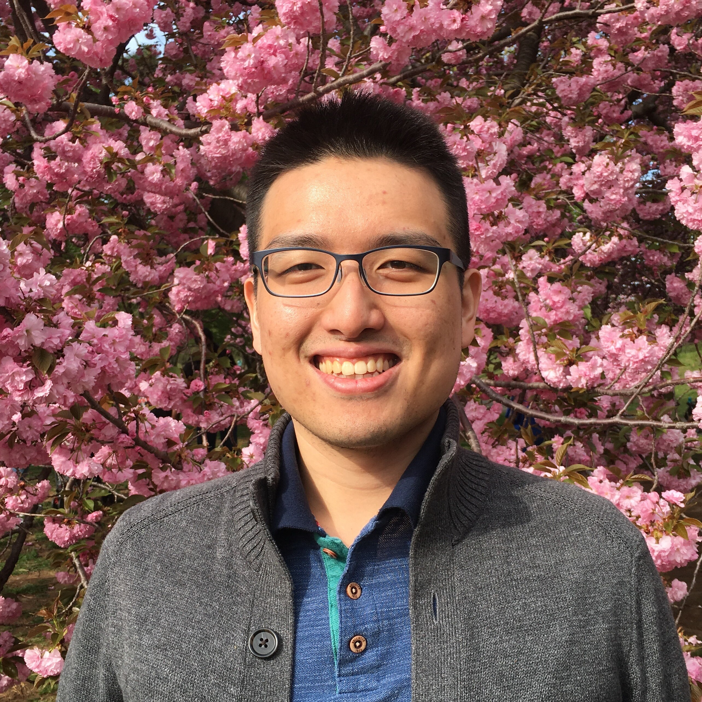
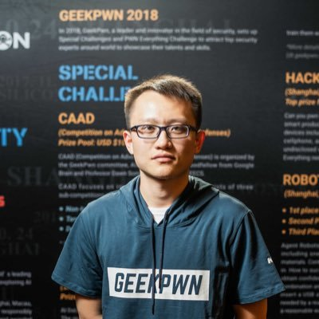
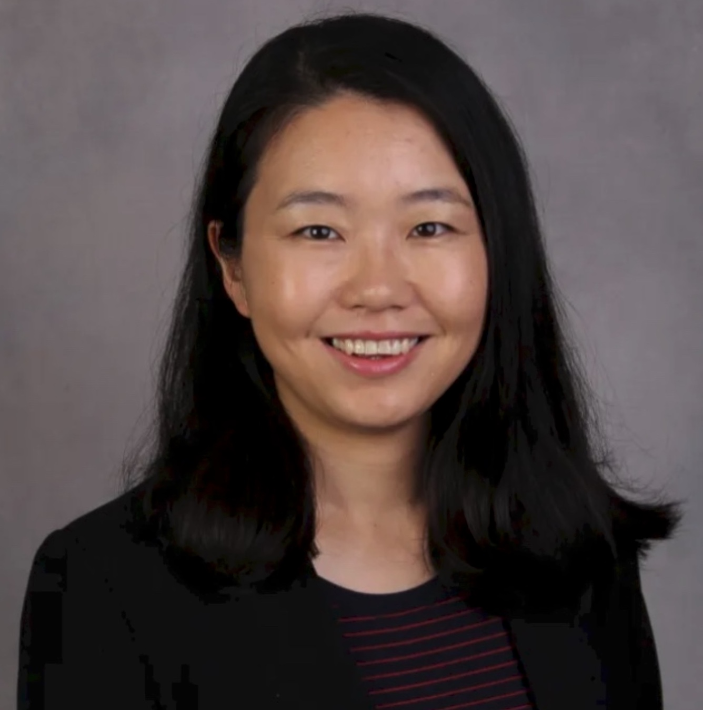
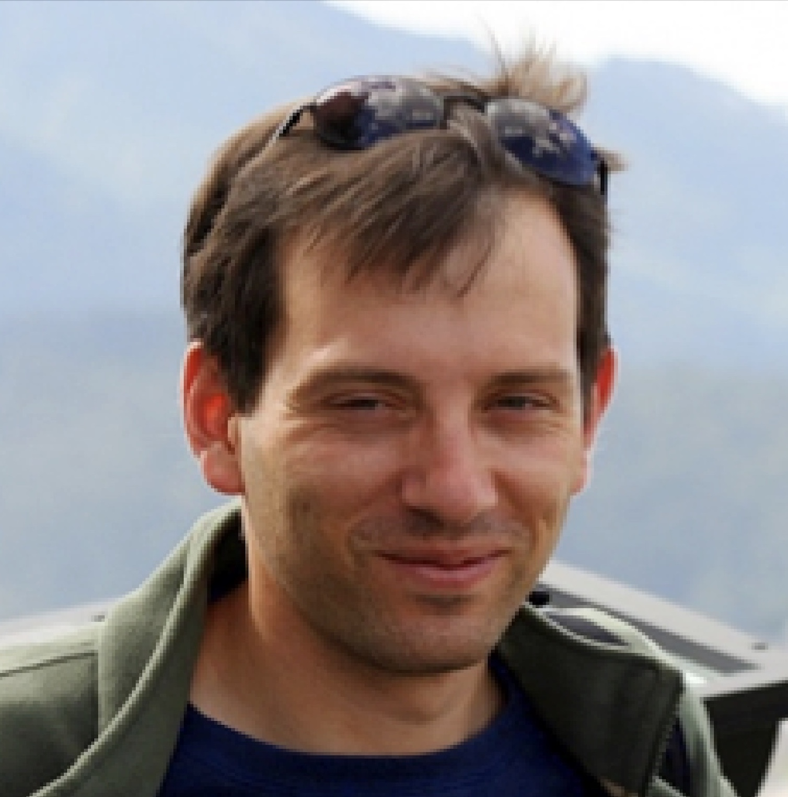
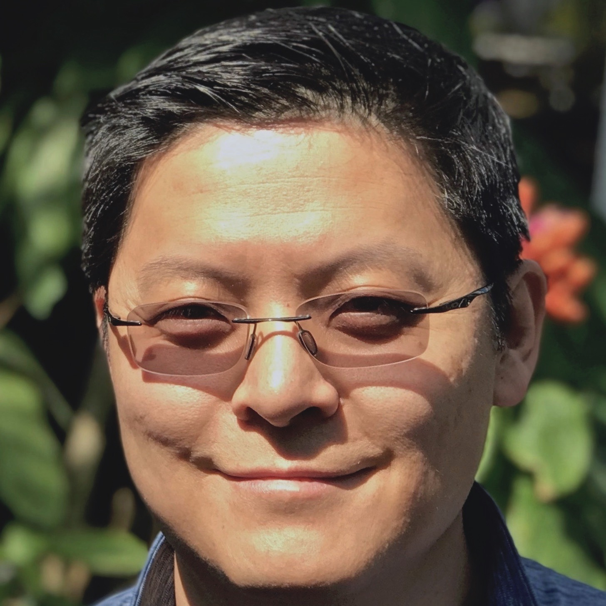

# Speakers
Speakers are in alphabetical order by last name.

||||
|[Pin-Yu Chen](https://sites.google.com/site/pinyuchenpage/home) IBM Research AI|[Wenbo Guo](https://henrygwb.github.io/) UC Berkeley|[Ruoxi Jia](https://ruoxijia.info/) Virginia Tech |
||||
|[Bo Li](https://aisecure.github.io/) UIUC|[Michael Mahoney](https://www.stat.berkeley.edu/~mmahoney/) UC Berkeley and ICSI|[Vitaly Shmatikov](https://www.cs.cornell.edu/~shmat/) Cornell Tech |
||||
|[Trojai](https://pages.nist.gov/trojai/docs/about.html) Trojai|[Yang Zhang](https://yangzhangalmo.github.io/) CISPA|[Ben Y. Zhao](https://people.cs.uchicago.edu/~ravenben/) UChicago |